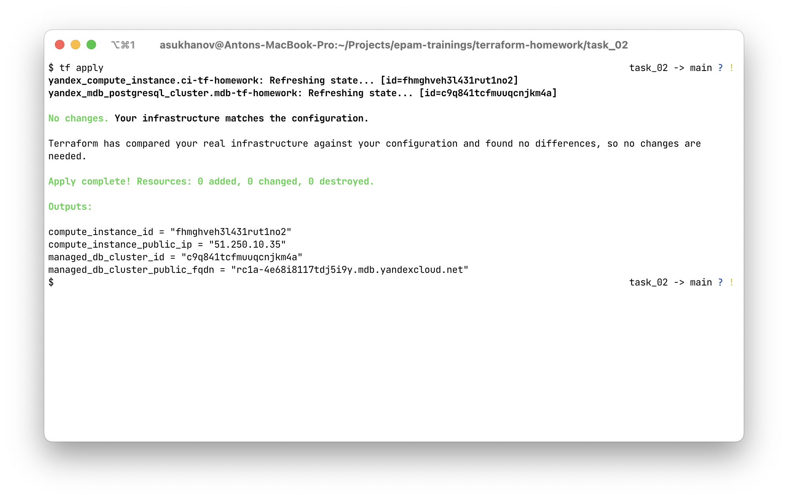
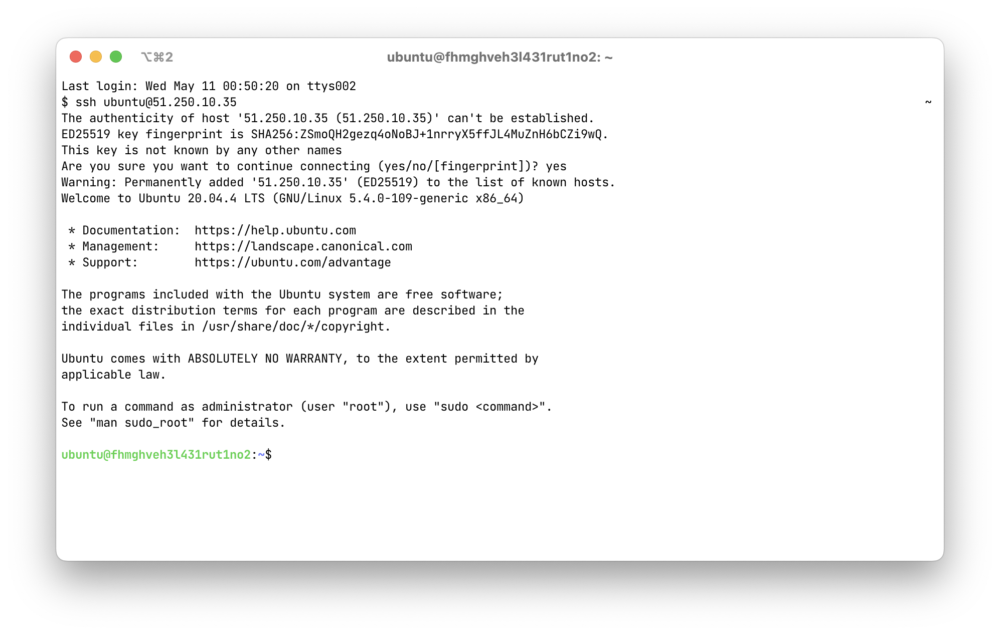
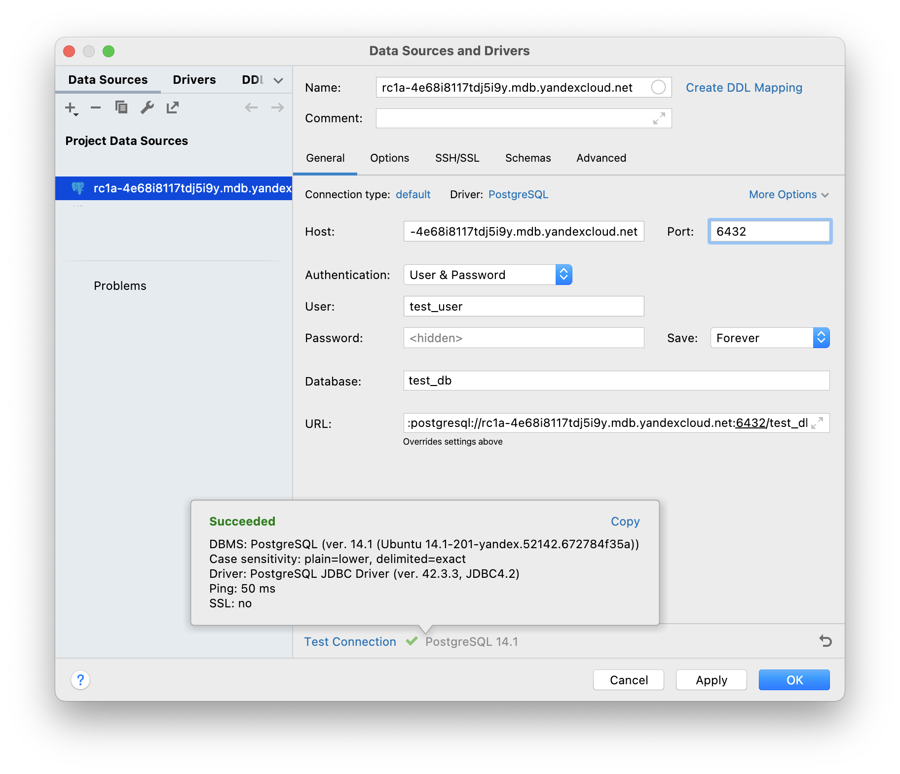

## Task 2

**P.S.: At this moment compute instances do not support provisioning (cannot run OS commands during creation). Maybe we can do some provisioning using specific terraform provider or use Ansible instead.**
